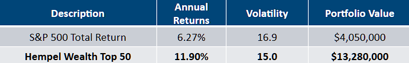
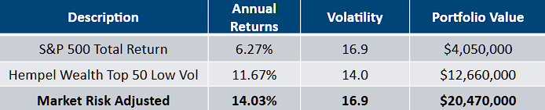
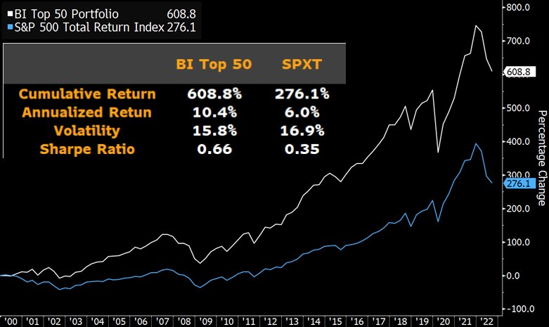
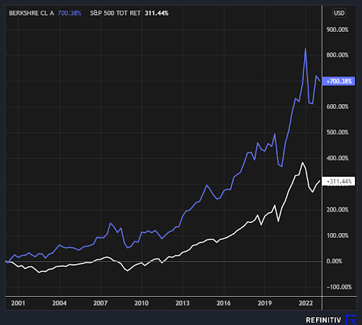
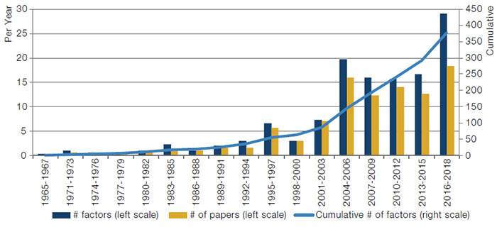

# Hempel Top 50 Quantitative Factor Investment Model

**Hempel Top 50** is a python framework for analyzing Factor Investment Strategies. 

It was created in Q1 2023 by the quantitative developers at Hempel Wealth Management LLC, an investment advisory firm that has ceased operations. 

If you are seeking investment advice, I recommened talking to a CFP professional. This codebase has been made public for posterity's sake, for this research was possible because I stood on the shoulders of giants.


## Results
Developed two proprietary Factor Investment models, "Hempel Wealth Top 50" and "Hempel Wealth Top 50 Low Volatility". Both models had a higher annual return than the S&P 500 with lower volatility and a lower max drawdown over a period of 20+ years.

### Model: Hempel Top 50

Time period: 2000-1-1 to 2022-12-31; Quarterly Rebalanced; portfolio of the 50 best stocks from the S&P 500; Max Drawdown -35.3% vs. S&P500 -45.8%



### Model: Hempel Top 50 Low Volatility

Time period: 2000-1-1 to 2022-12-31; Quarterly Rebalanced; portfolio of the 50 best stocks from the S&P 500; Max Drawdown -35.2% vs. S&P500 -45.8%



## Disclaimer

The results are hypothetical and are NOT an indicator of future results and do NOT represent returns that an investor actually attained. Indexes are unmanaged, do not reflect management or trading fees, and one cannot invest directly in an index. 
Source: Refinitiv, Hempel Wealth Management LLC


## Bloomberg MVP
This framework was initially designed to validate [Bloomberg's MVP Index](https://www.bloomberg.com/professional/products/indices/quote/BMVP:IND) using a different data provider, specifically LSEG/Refinitiv/Thomson Reuters. Bloomberg's research has since been used to launch an ETF, [Invesco Bloomberg MVP Multi-factor ETF](https://www.invesco.com/us/financial-products/etfs/product-detail?audienceType=investor&ticker=bmvp), ticker BMVP. The investment strategy "is constructed to track the performance of US large cap companies that exhibit strong fundamental characteristics for Momentum (M), Value (V), Volatility (V), and Profitability (P) utilizing a factor model developed by Bloomberg Intelligence."


Source: [Gina Martin Adams](https://twitter.com/GinaMartinAdams/status/1598431923294150656)

## Warren Buffett & Berkshire Hathaway
 It can also be used to confirm Warren Buffet's historical investment outperformance described in terms of investment factors. Berkshire Hathaway has had a significant outperformance in investment returns that can NOT be explained using traditional Farma-French factors [Beta, Size, and Value]. However, this unexplained outperformance disappears when controlling for Low Volatility and Profitability factors. In short, Buffett’s returns appear to be neither luck nor magic, but, rather, reward for the use of Low Volatility, Value, and Profitable stocks.

Source: [Buffett’s Alpha - Pedersen 2013](https://www.nber.org/papers/w19681)

Model: 
100% Berkshire Hathaway Class A Stock
Historically, Warren Buffet’s investment approach can be described as a 1.6x leveraged portfolio using Value, Quality, Low Volatility Factors. Again over the same time frame from Jan. 1, 2000, to Dec. 31, 2022, Buffet more than double the cumulative return of the S&P 500.



## Factor History 

Since the development of the first asset pricing model in 1961, the Capital Asset Pricing Model (CAPM), academic models have attempted to explain individual stock performance.

The CAPM model suggested that higher volatility stocks should have a higher expected rate of return, otherwise a rational investor wouldn’t invest. With the benefit of hindsight, the model was wrong. In the 60 years since CAPMs introduction, academic evidence actually shows the **most volatile group of stocks dramatically underperforms** the rest of the market.

From CAPM, academic research jumped forward with the Fama-French three-factor model (volatility, size and value), then to the Carhart four-factor model (which added momentum). The Zhang q-factor model was another leap forward  (volatility, size, investment, and profitability), which motivated Fama-French to develop a five-factor and six-factor models (which took the q-factor model and added value and momentum).

### Factor Explosion



~ 450 models published in top academic journals through to the end of December 2018, via Harvey and Liu (2019).

### Reoccuring Factors
Throughout the decades of academic research, a few factor categories keep showing up to explain an individual stock performance. 
- Size
- Value
- Investment
- Momentum
- Expected Growth
- Profitability / Quality
- High Beta vs. Low Volatility


### Traditional Factors
**Volatility:** While high beta historically was associated with higher absolute returns, the low volatility stocks have delivered higher risk-adjusted returns. Many investors, such as individuals, pension funds and mutual funds, are constrained in the leverage that they can take, and therefore must overweight riskier securities instead, creating a Low volatility anomaly.

**Small Size:** One of the oldest and most persuasive arguments in the stock market is that small stocks outperform large stocks. However, recent research to suggest that “There Is No Size Effect”

**Value:** the most famous factor, is the tendency for relatively cheap stocks to outperform relatively expensive stocks over time. Recent academic research suggests the value factor can be eliminated since it can be better explained using other factors

### Modern Factors
**Momentum** is the tendency for past price performance to continue in the near future. However, the q-factor model has found that the Momentum factor can be explained by a combination of Profitability and Expected Growth.

**Profitability** is the observation that investing in highly profitable stocks tend to significantly outperform companies of lower profitability.

**Investment** is the observation that firms that are more conservative in asset growth have higher future returns. 

**Expected Growth** is a combination of the firm’s valuation, cash flow, and profitability.

## Only 46 Investment Factors that Matter
[**“Replicating Anomalies” by Hou, Xue, & Zhang (2017)**](https://papers.ssrn.com/sol3/papers.cfm?abstract_id=2961979)
Hou, Xue and Zhang conducted a gigantic replication of the entire anomalies literature by compiling the largest-to-date data library with 447 anomaly variables. This included 57 variables on momentum, 68 variables on value-versus-growth, 38 variables from investment, 79 variables on profitability, 103 variables on intangibles, and 102 variables on trading frictions categories, using a common set of procedures. They results found indicate widespread statistical p-hacking in the anomalies literature.

Out of 447 anomalies, 64% are insignificant at the standard 5% level; imposing a t-value of 3 cutoff, rather than the standard t-test of 1.96, raised the number of insignificant anomalies further to 85%:

- 161 anomalies are Significant at the 95% confidence level with a t-test ≥ 1.96
- 67 anomalies are Very Significant with more than 99% confidence (t-test ≥ 3) by imposing a cutoff t-value of 3, instead of the conventional 95% level.
- Applying the q-factor model to explain the 161 significant anomalies, **left 46 unexplained alphas with significance (and 11 anomalies with t-test ≥ 3)**.

Combining all 46 q-anomalies leads to an average return spread of 1.66% [per month or 21.8% annualized] (t = 10.28). 


## Requirements

* LSEG Workstation, formerly Refinitiv
* Python 3.10 or greater
* Access to PIP package manager

## Installation

```bash
# Clone the repository
git clone https://github.com/blakehempel/top50.git
cd top50

# (Optional) Create and activate a virtual environment
python -m venv venv
source venv/bin/activate  # On Windows: venv\Scripts\activate

# Install Poetry if you don't have it
pip install poetry

# Install dependencies
poetry install
```

## Usage

1. Run LSEG workstation on your local machine, enable api

2. Set appropriate date range in configuration.csv, if needed.

3. Run start() method in eikondataloader 
   1. Will download fundamental data from refinitiv using API
   2. Calculate factor data from the raw fundamental data

4. In the researchengine, applyFactorModel() method, and select the model of your choice; the default is the Bloomberg MVP model.

5. Run researchengine, start() method


## Acknowledgments

alpha architect https://alphaarchitect.com/2021/04/building-a-better-q-factor-asset-pricing-model/

AQR https://www.aqr.com/Research-Archive/Perspectives/There-is-No-Size-Effect-Daily-Edition

Aswath Damodaran https://pages.stern.nyu.edu/~adamodar/New_Home_Page/datafile/histretSP.html

Chris Cain https://cmtassociation.org/wp-content/uploads/2020/03/Cain-and-Connors-2020-Dow-Award-1.pdf

Man Group https://www.man.com/insights/factors

Zhang (2015) “Digesting Anomalies: An Investment Approach” https://papers.ssrn.com/sol3/papers.cfm?abstract_id=2508322

Zhang (2017) “Replicating Anomalies” https://papers.ssrn.com/sol3/papers.cfm?abstract_id=2961979


## License

This project is licensed under the [GPL](LICENSE).
